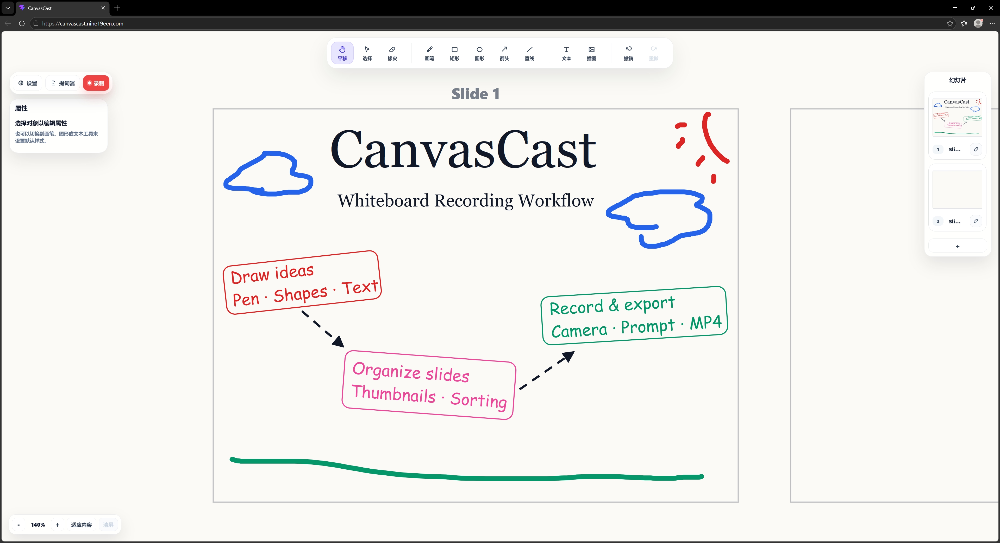
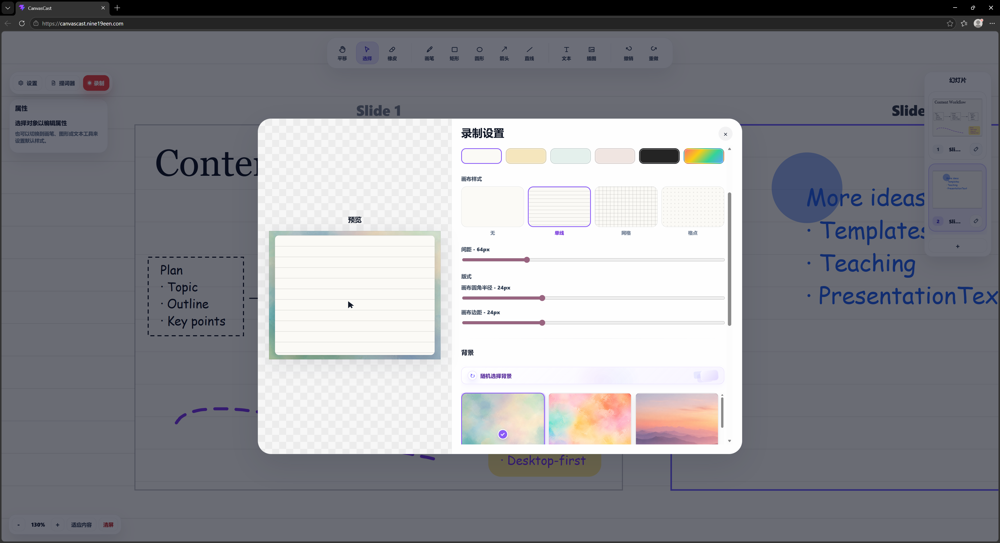

# CanvasCast

CanvasCast is a browser-based whiteboard recording app built with React, TypeScript and Vite.

It is inspired by modern screen recording tools and digital whiteboard tools, focusing on a smooth workflow for drawing, presenting, recording and exporting whiteboard-style content directly in the browser.

## Demo

Online Demo: https://canvascast.nine19een.com

Demo Video: [Watch on Bilibili](https://www.bilibili.com/video/BV1EwRMBxEY7/?spm_id_from=333.1387.upload.video_card.click&vd_source=0ecce3e22bc5a1f351535d3d98dcdbfe)

## Overview

CanvasCast brings together an infinite whiteboard, slide-based presentation flow, recording settings, frame backgrounds, camera overlay, microphone selection and a teleprompter into one browser-based workspace.

It is designed for technical explanations, teaching videos, visual notes, product walkthroughs and whiteboard-style presentation recordings. Instead of preparing a separate screen recorder, drawing app and video editor, CanvasCast focuses on a lightweight workflow for creating and recording structured whiteboard content in one place.

## Use Cases

- Teaching and short lecture recording: Teachers can record focused explanation videos for a single concept, exercise or topic.
- Technical explanation: Developers and creators can explain architecture, workflows, APIs, diagrams or implementation ideas visually.
- Algorithm and programming walkthroughs: The slide workflow works well for step-by-step reasoning, data structure diagrams and code explanation outlines.
- Visual note-taking: CanvasCast can be used to turn rough notes, sketches and diagrams into short recorded walkthroughs.
- Project presentation: Students and makers can prepare several slides and record a clear project explanation.
- Product or portfolio demo: The app is suitable for quick product flow explanations, portfolio walkthroughs and feature demos.
- Quick whiteboard-style recording without complex video editing tools: CanvasCast is intended for lightweight browser-based recording, not full video post-production.

## Basic Workflow

1. Open the online demo in a desktop browser.
2. Create whiteboard content with the pen, shapes, arrows, text and images.
3. Organize the content with multiple slides.
4. Open the recording settings panel.
5. Choose the canvas ratio, canvas color, canvas pattern and frame background.
6. Optionally enable the camera overlay, choose a microphone and use the teleprompter.
7. Start recording and present your slides.
8. Export the recording as a video file.

## Desktop-first Notice

CanvasCast is currently designed for desktop browsers. The current version is not intended for full editing or recording on mobile phone screens.

## Browser Compatibility Note

For the best experience, use a modern Chromium-based browser such as Microsoft Edge or Google Chrome. Browser support for the MediaRecorder API and MP4 / WebM recording formats may vary.

## Features

- Infinite whiteboard workspace
- Slide-based recording workflow
- Freehand pen with smoother SVG path rendering
- Object-level eraser
- Rectangle / ellipse / arrow / straight line tools
- Text insertion
- Image insertion
- Object selection, movement, scaling and rotation
- Multi-selection transform
- Slide thumbnails
- Slide duplication, deletion, renaming and drag sorting
- Frame background picker with built-in background presets
- Random background selection
- Canvas ratio presets: 16:9, 4:3, 3:4, 9:16, 1:1
- Canvas color settings
- Canvas pattern settings
- Camera overlay
- Independent microphone device selection
- Teleprompter with adjustable speed and opacity
- Browser-based recording output

## Screenshots

### Main Interface



### Multi-slide Workflow


### Recording Settings



### Recording Output


## Tech Stack

- React
- TypeScript
- Vite
- SVG-based whiteboard rendering
- MediaRecorder API
- CSS responsive layout

## Getting Started

Install dependencies:

```bash
npm install
```

Start the development server:

```bash
npm run dev
```

## Type Check

```bash
npx tsc --noEmit -p tsconfig.app.json --pretty false
```

## Build

```bash
npm run build
```

## Project Highlights

### SVG-based whiteboard object system

CanvasCast stores whiteboard content as editable objects and renders them with SVG. This keeps elements selectable and transformable instead of flattening the board into static pixels.

### Slide-based recording workflow

The app supports multiple slides, slide thumbnails, slide ordering and a recording frame workflow, making it easier to structure whiteboard content as a presentation.

### Recording frame and background system

The recording preview and browser recording output are designed to stay visually aligned. CanvasCast supports canvas ratios, frame backgrounds, canvas colors and canvas patterns as part of the recording setup.

### Camera and microphone support

Camera overlay and microphone input are controlled separately. Users can record with a camera overlay, record audio only, or disable microphone input when needed.

### Teleprompter

CanvasCast includes a floating teleprompter with playback controls, adjustable scrolling speed and opacity settings for smoother recording sessions.

## Current Status

CanvasCast is currently in the MVP stage.

Core whiteboard editing, slide workflow, recording settings, frame backgrounds, camera overlay, teleprompter and browser-based recording have been implemented.

## Roadmap

- More export options
- More advanced image editing
- Better pressure-like pen rendering
- More transition effects
- Performance optimization for larger whiteboards
- Better mobile and tablet support

## Notes

CanvasCast is a personal learning and portfolio project focused on product interaction, browser media APIs and whiteboard editing workflows.

# CanvasCast 中文说明

## 演示

在线体验：https://canvascast.nine19een.com

演示视频：[B站观看](https://www.bilibili.com/video/BV1EwRMBxEY7/?spm_id_from=333.1387.upload.video_card.click&vd_source=0ecce3e22bc5a1f351535d3d98dcdbfe)

## 项目简介

CanvasCast 是一个基于 React、TypeScript 和 Vite 构建的浏览器端白板录制工具。

项目灵感来自现代录屏软件和数字白板工具，重点围绕白板绘制、幻灯片式演示、录制设置、背景装饰、摄像头小窗、麦克风选择与提词器等功能，形成一套可以直接在浏览器中完成白板内容创作与录制导出的工作流。

它适合算法讲解、课程演示、技术说明、可视化笔记、作品集 demo、产品流程说明等场景。CanvasCast 更关注轻量、直接、可操作的白板录制体验，而不是复杂的视频后期剪辑。

## 适合的使用场景

- 课堂知识点讲解：老师可以用它录制短知识点视频。相比普通 PPT，它更适合边讲边写、边画图、边推导。
- 课前预习与课后补充：可以提前录制 5 到 10 分钟的白板讲解视频，作为课前预习材料；也可以用于课后补充说明和复习。
- 编程与算法讲解：可以讲解代码逻辑、算法步骤、数据结构示意图、流程图和技术方案。
- 项目展示与汇报说明：适合课程项目、创新创业项目、个人作品集 demo、产品流程说明等需要边讲边展示的内容。
- 快速制作演示视频：不需要复杂剪辑软件，准备几页白板内容后即可录制导出。

## 基本使用流程

1. 使用电脑端浏览器打开网站。
2. 在白板中创建和编辑内容，可以使用画笔、图形、箭头、文本和图片。
3. 使用多页幻灯片组织讲解内容，让录制过程更有结构。
4. 打开录制设置，调整画布比例、背景、画布颜色和画布样式。
5. 如有需要，打开提词器，提前准备讲解脚本。
6. 根据录制需要开启摄像头小窗，或只选择麦克风录制声音。
7. 点击录制按钮开始讲解。
8. 录制结束后导出视频文件。

## 使用建议

- 每页内容不要放得太满，尽量让一页幻灯片只讲一个重点。
- 录制前可以先准备几页内容，再按顺序讲解。
- 正式录制前先检查麦克风设备，避免无声或设备选错。
- 教学讲解可以不开摄像头，只录声音和白板内容。
- 正式使用前建议先试录一小段，确认画面比例、声音和背景效果。
- 推荐使用电脑端浏览器访问，当前版本不适合在手机上完整编辑和录制。

## 功能特性

- 无限白板工作区
- 基于幻灯片的录制工作流
- 平滑自由画笔
- 对象级橡皮
- 矩形、圆形、箭头、直线、文本、图片
- 对象选择、移动、缩放、旋转、多选变换
- 幻灯片缩略图、复制、删除、重命名、拖拽排序
- 内置背景图与随机背景
- 多种画布比例：16:9、4:3、3:4、9:16、1:1
- 画布颜色与样式设置
- 摄像头小窗
- 独立麦克风选择
- 提词器
- 浏览器端录制导出

## 技术栈

- React
- TypeScript
- Vite
- SVG 白板渲染
- MediaRecorder API
- CSS 响应式布局

## 截图

截图见上方英文部分的 Screenshots。

## 本地运行

安装依赖：

```bash
npm install
```

启动开发服务器：

```bash
npm run dev
```

类型检查：

```bash
npx tsc --noEmit -p tsconfig.app.json --pretty false
```

构建：

```bash
npm run build
```

## 项目亮点

### SVG 对象化白板渲染

白板内容以可编辑对象数组进行管理，并通过 SVG 渲染。相比静态像素画布，这种方式更适合对象选择、移动、缩放、旋转和后续编辑。

### 多幻灯片录制工作流

CanvasCast 支持多张幻灯片、缩略图、复制、删除、重命名和拖拽排序，便于把白板内容组织成适合录制的演示结构。

### 预览与录制输出一致性

录制设置中的画布比例、背景图、画布颜色、画布样式、圆角和边距会尽量与最终浏览器录制输出保持一致。

### 摄像头与麦克风独立控制

摄像头小窗和麦克风设备选择相互独立。用户可以显示摄像头录制，也可以关闭摄像头但保留麦克风声音。

### 提词器辅助录制

内置提词器支持播放控制、滚动速度和透明度调整，适合需要脚本辅助的讲解和演示录制。

## 当前版本限制

- 当前主要面向电脑端浏览器。
- 手机端暂不适合完整编辑和录制。
- 复杂对象较多时，性能表现可能受设备配置影响。
- 不同浏览器对录制格式的支持可能存在差异。
- 当前更适合轻量讲解和演示，不是专业视频剪辑软件。

## 当前状态

CanvasCast 目前处于 MVP 阶段。核心白板编辑、幻灯片工作流、录制设置、背景图、摄像头小窗、麦克风选择、提词器和浏览器端录制功能已经完成。

后续会继续优化导出能力、移动端适配、性能表现和更多录制体验。

## 后续计划

- 更多导出选项
- 更高级的图片编辑能力
- 更接近压感效果的画笔渲染
- 更多切换和演示效果
- 大型白板下的性能优化
- 更好的移动端和平板支持

# License / 使用许可

Copyright © 2026 nine19een. All rights reserved.

This project is published for learning, demonstration, and portfolio purposes only.
No permission is granted to copy, modify, redistribute, sublicense, or use this project or its source code for commercial purposes without explicit written permission from the author.

本项目仅用于个人学习、作品集展示与技术交流。未经作者明确书面许可，不得复制、修改、二次发布、再许可或用于商业用途。